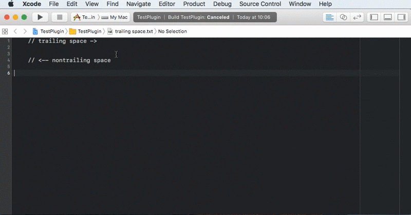

# Strimmer

Strimmer is an Xcode 8 Source Code Extension that quickly strips all trailing whitespace from the current file.

## Why?

There are options in` Xcode Preferences > Text Editing > Editing` to `Automatically trim trailing whitespace`, `Including whitespace-only lines`. However this only works when your cursor moves past the line containing whitespace. This has the unfortunate side effect of meaning code copy and pasted in introduces whitespace lines. If you are smart you probably run [SwiftLint](https://github.com/realm/SwiftLint), which flags the trailing whitespace. It can also probably automatically fix it.

However, I wanted to make an Xcode extension. So here we are...

## How to use:

Until we can ship extensions, you will have to build this on your own.

1. Download Xcode 8 beta.
2. Open Xcode 8 beta, and install required dependencies.
3. If you are using El Capitan, open Terminal and run `sudo /usr/libexec/xpccachectl`, then restart your Mac.
4. Open the `StrimmerWrapper.xcodeproj` file in Xcode 8.
5. Choose the `Strimmer` scheme, and build and run.
6. Choose Xcode 8 as the target.
7. In the new Xcode 8 instance, with the grey Xcode icon, click `Editor > Strimmer > Strip All Whitespace from File`.

### That didn't work...

The first Xcode 8 beta (8S128d) seems super buggy. Sometimes the Editor menu shows `Strimmer` but it doesn't have a fly out menu. If this happens, the following steps may help:

* Clean build, and build folder
* Restart Xcode
* Rename the menu action slightly
* Run the Xcode 8 target, select a line of text, stop the Xcode 8 target, and run again
* Try again under a full moon
* Shout loudly at Xcode
* Sob uncontrollably

